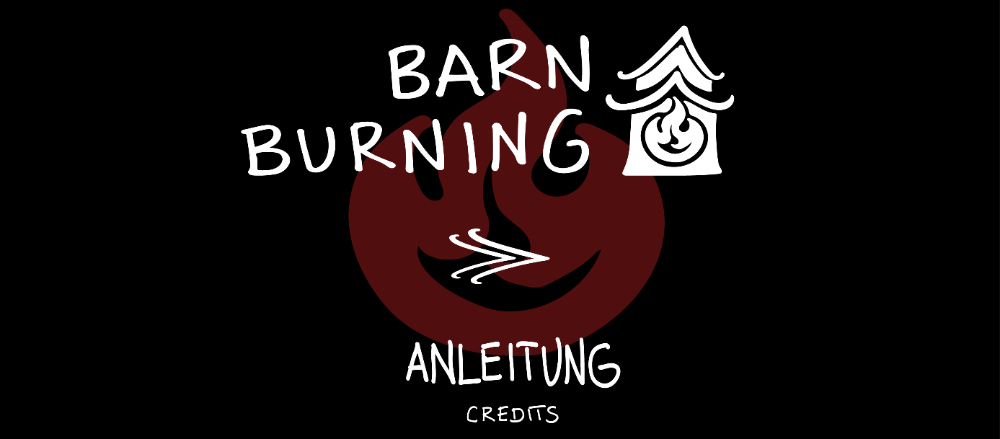
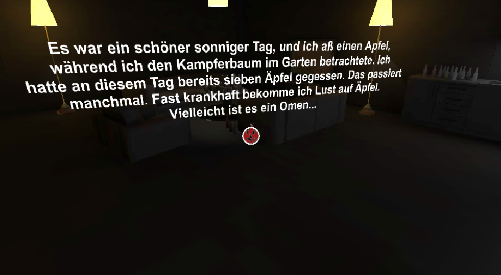
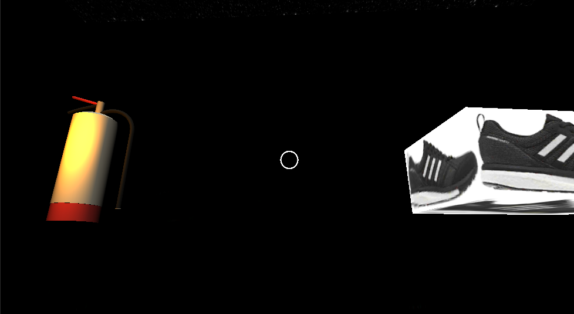

**Barn Burning READ ME Eckertz Makome Schwarz Rothkamp**

Unsere VR-Anwendung soll die Kurzgeschichte Barn Burning von Haruki Murakami nacherzählen. Der User befindet sich in unterschiedlichen Räumen, in denen der User Points of Interest findet, welche die Story, z.B. mit Zitaten aus der Kurzgeschichte, erzählen. Die Points of Interest transformieren die “normalen“ Räume in die Räume von Barn Burning.
 

Während der User die Hauptszene durchlebt, soll er z.B. von Hintergrundgeräuschen gestört werden, danach muss eine Entscheidung getroffen werden, deren Auswirkung nicht absehbar ist. Hier unterscheidet sich unsere VR-Anwendung von der Kurzgeschichte, denn es gibt zwei mögliche Enden. 

